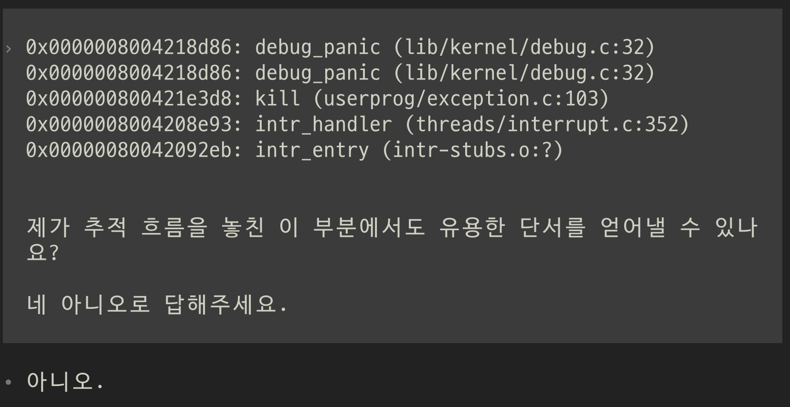
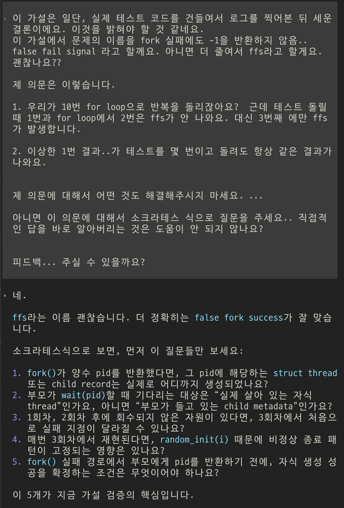

# Pintos project2: user program 회고

### 이해건
---

# 휴식도 몰입의 일부이다

> 계속 붙잡는 것만이 노력은 아니다.

- 충분히 고민한 뒤의 휴식은 사고를 재정리하게 만든다
- 수면과 휴식은 기억과 연결을 다시 구성하는 시간이 될 수 있다
- 막힌 지점에서는 휴식이 오히려 유일한 돌파구일 수도 있다

---

# 휴식도 몰입의 일부이다

## 좋은 휴식
> 뇌가 다시 연결할 여지를 주는 휴식  
- 산책, 수면, 멍 때리기, 가벼운 정리
- 다음에 다시 볼 수 있게 막힌 지점을 적어두기

## 나쁜 휴식
> 자극이 너무 강해서 머리를 더 소모하는 휴식
- 무한 숏폼, 음주, 밤샘, 목적 없는 회피
- 쉬었는데 오히려 더 피곤해지는 상태

---

# 디버깅도 구조화할 수 있다

현상 관찰
→ 가설 설정
→ 로그/흐름 추적
→ 가설 검증
→ 수정
→ 재검증

> 내가 지금 어디서 막혔는지 알았다면,
> 갈피를 잃는 시간을 줄일 수 있었을 것 같다.

---

# 디버깅 과정에서 AI 사용하기

## 도움이 됐던 사용
- 테스트 코드 이해
- “네/아니오” 단답으로 답변하게 해서 과도한 스포 방지

---
# 디버깅 과정에서 AI 사용하기

## 아쉬웠던 점
- 직접 검증할 수 있는 가설까지 AI에게 먼저 맡김
- 삽질하는 시간은 줄었지만, 직접 틀려보는 경험은 줄어듦

> AI 도움은 나쁜 삽질을 하고 있을 때에만